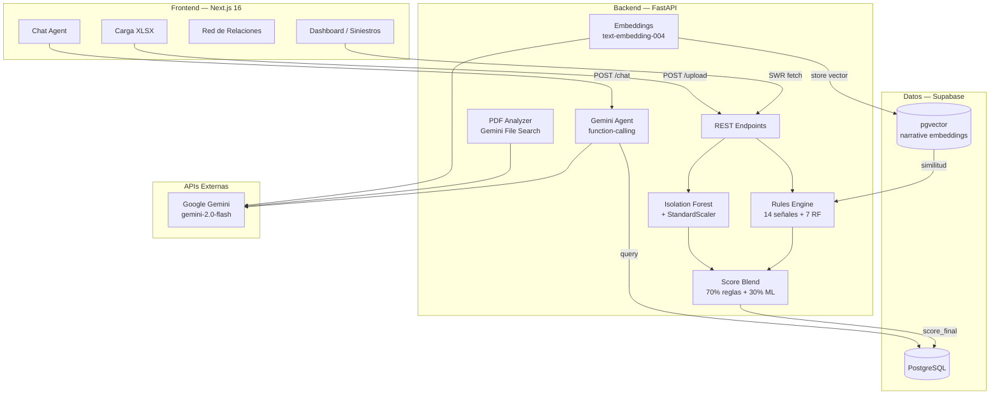

# Arquitectura del Sistema — FraudIA

## Visión General

FraudIA sigue una arquitectura de **tres capas** con IA integrada en el backend:

1. **Capa de Presentación** — Next.js App Router (frontend)
2. **Capa de Lógica de Negocio** — FastAPI (backend Python)
3. **Capa de Datos e IA** — Supabase (PostgreSQL + pgvector) + Gemini + Isolation Forest

---

## Diagrama de Componentes



---

## Flujo de Scoring de un Siniestro

```
POST /siniestros/upload (XLSX)
    │
    ├─ Parsear filas → lista de dicts
    │
    ├─ Para cada siniestro:
    │   ├─ evaluar_siniestro() → score_reglas (0–100), alertas[]
    │   ├─ predict_score()     → score_anomalia (0–100)
    │   └─ blend:              score_final = 0.7 × score_reglas + 0.3 × score_anomalia
    │
    ├─ Clasificar nivel_riesgo:
    │   ├─ 0–40   → Verde
    │   ├─ 41–75  → Amarillo
    │   └─ 76–100 → Rojo
    │
    ├─ Gemini genera explicacion_agente (async, con cache Supabase)
    │
    └─ Upsert a Supabase tabla siniestros
```

---

## Flujo del Agente Conversacional

```
POST /chat { message, conversation_history }
    │
    ├─ Gemini recibe system prompt + tools disponibles
    │   Tools: get_top_riesgo, get_siniestro_detalle,
    │          get_proveedores_alertas, get_resumen_ejecutivo,
    │          search_siniestros_similares
    │
    ├─ Gemini decide qué tool llamar
    ├─ FastAPI ejecuta query a Supabase
    ├─ Resultado → Gemini genera respuesta en español
    └─ Stream de vuelta al frontend
```

---

## Decisiones de Diseño

| Decisión | Razón |
|----------|-------|
| Blend 70/30 reglas + ML | Reglas dan trazabilidad; ML captura anomalías numéricas no cubiertas por reglas |
| Isolation Forest (no supervisado) | Dataset sin etiquetas confiables de fraude real; el modelo detecta outliers sin necesitar ground truth |
| pgvector en Supabase | Similitud de narrativas en la misma DB sin infraestructura extra |
| Gemini function-calling | El agente puede consultar datos reales en Supabase; no alucina cifras |
| SWR caching en frontend | El scoring es caro (LLM); cachear respuestas evita recalcular en cada render |
| Fallback OpenAI → Gemini | Si Gemini falla, el agente sigue funcionando con GPT-4o |

---

## Escalabilidad Futura

- Reemplazar Isolation Forest con modelo supervisado cuando se acumulen etiquetas reales de fraude confirmado
- Cola de jobs (Redis/Celery) para scoring asíncrono en batch grande
- Webhooks desde core de siniestros para scoring en tiempo real al momento de registro
- RBAC en Supabase para segmentar acceso por analista / jefe / auditor
