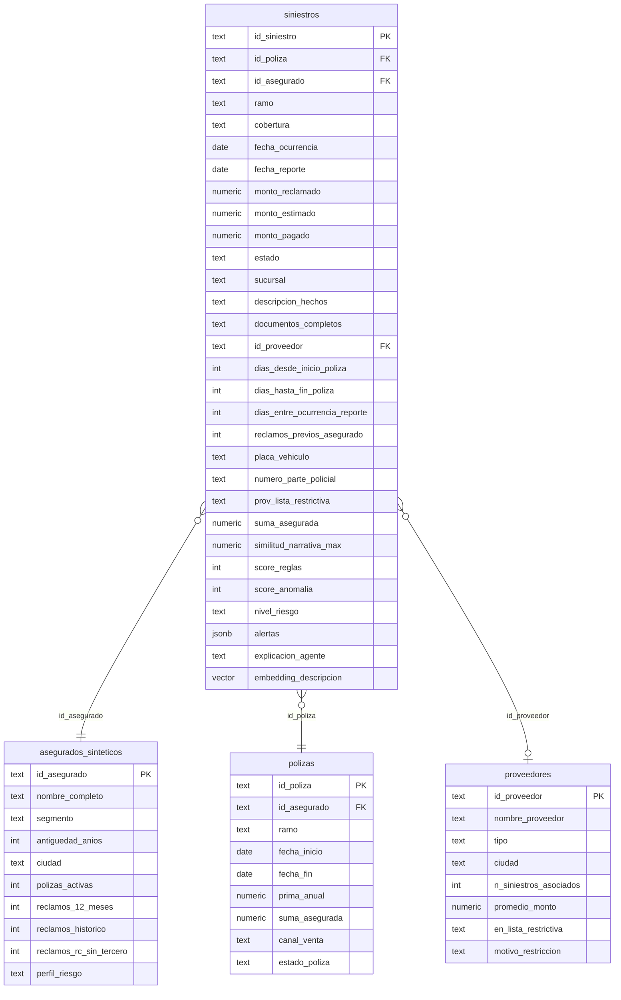

# Modelo de Datos — FraudIA

## Diagrama Entidad-Relación



---

## Descripción de Tablas

### `siniestros` (tabla principal)

| Campo | Tipo | Descripción |
|-------|------|-------------|
| `id_siniestro` | text PK | Identificador único (ej. SIN-0001) |
| `id_poliza` | text FK | Referencia a póliza |
| `id_asegurado` | text FK | Referencia a asegurado (anónimo) |
| `id_proveedor` | text FK | Taller, clínica, perito (referencia a proveedores) |
| `ramo` | text | Autos, Salud, Vida, Generales, Hogar |
| `cobertura` | text | Choque, Robo, Atención médica, Incendio, etc. |
| `placa_vehiculo` | text | Placa del vehículo involucrado |
| `fecha_ocurrencia` | date | Fecha del evento |
| `fecha_reporte` | date | Fecha de notificación |
| `monto_reclamado` | numeric | Valor solicitado |
| `monto_estimado` | numeric | Estimado por aseguradora |
| `monto_pagado` | numeric | Pagado (si aplica) |
| `estado` | text | Reserva / Pago Total / Negativa / Liquidado / etc. |
| `sucursal` | text | Sucursal del siniestro |
| `descripcion_hechos` | text | Narrativa libre del reclamo |
| `documentos_completos` | text | "Sí" / "No" |
| `prov_lista_restrictiva` | text | "Sí" si proveedor en lista restrictiva |
| `dias_desde_inicio_poliza` | int | Días entre inicio de póliza y siniestro |
| `dias_hasta_fin_poliza` | int | Días entre siniestro y vencimiento de póliza |
| `dias_entre_ocurrencia_reporte` | int | Demora en reportar |
| `reclamos_previos_asegurado` | int | Siniestros previos del asegurado |
| `suma_asegurada` | numeric | Cobertura máxima de la póliza |
| `numero_parte_policial` | text | Número de parte policial (nullable) |
| `similitud_narrativa_max` | numeric | Similitud coseno máxima con otros reclamos (0–1) |
| `score_reglas` | int | Score 0–100 del Rules Engine |
| `score_anomalia` | int | Score 0–100 del Isolation Forest |
| `nivel_riesgo` | text | Verde / Amarillo / Rojo |
| `alertas` | jsonb | Array de `{señal, pts, tipo}` activadas |
| `explicacion_agente` | text | Explicación generada por Gemini (cacheada) |
| `embedding_descripcion` | vector | Embedding de descripcion_hechos para pgvector |
| `pdf_analysis` | text | Resultado del análisis de documentos PDF |

### `asegurados_sinteticos`

Perfil del asegurado. Campos: `id_asegurado`, `nombre_completo`, `segmento` (Natural/Jurídico), `ciudad`, `antiguedad_anios`, `polizas_activas`, `reclamos_12_meses`, `reclamos_historico`, `reclamos_rc_sin_tercero`, `perfil_riesgo` (Alto/Medio/Bajo). Usado para señal de frecuencia (Señal 4) y enriquecer el scoring.

### `polizas`

Campos: `id_poliza`, `id_asegurado`, `ramo`, `fecha_inicio`, `fecha_fin`, `suma_asegurada`, `prima_anual`, `canal_venta` (Bancaseguros/Agente/Directo), `estado_poliza` (Vigente/Expirada/Cancelada). Usados para calcular `dias_desde_inicio_poliza` y `dias_hasta_fin_poliza`.

### `proveedores`

Talleres, clínicas y peritos. Campos: `id_proveedor`, `nombre_proveedor`, `tipo`, `ciudad`, `n_siniestros_asociados`, `promedio_monto`, `en_lista_restrictiva` ("Sí"/"No"), `motivo_restriccion`. Campo `en_lista_restrictiva = "Sí"` activa RF-03 (→ Rojo automático).

---

## Índices Relevantes

```sql
-- Búsqueda semántica de narrativas similares
CREATE INDEX ON siniestros USING ivfflat (embedding_descripcion vector_cosine_ops);

-- Filtros frecuentes en dashboard
CREATE INDEX ON siniestros (nivel_riesgo);
CREATE INDEX ON siniestros (score_reglas DESC);
CREATE INDEX ON siniestros (id_asegurado);
CREATE INDEX ON siniestros (placa_vehiculo);
```

---

## Notas

- Todos los identificadores son sintéticos — no corresponden a personas reales.
- `etiqueta_fraude_simulada` (0/1) existe en el dataset de entrenamiento pero **no** en producción; el modelo es no supervisado.
- `embedding_descripcion` usa dimensión 768 (`text-embedding-004` de Gemini).
